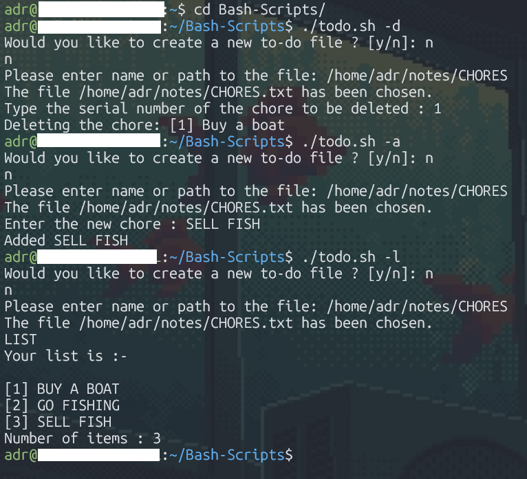

## Bash-Scripts

Bash scripts to automate some of my daily tasks.

---

### Preview


---

### Current Scripts

#### 1. To-Do List (`todo.sh`)

A simple Bash to-do list script that:
* Creates a new `.txt` file or uses an existing one.
* Lets you **add**, **delete**, and **view** your chores.
---

#### Usage

Clone or download the repository, then:

```bash
cd Bash-Scripts
chmod +x todo.sh       # make it executable
./todo.sh help         # show help/usage
./todo.sh -a           # add a chore (interactive)
./todo.sh -l           # view chores list
./todo.sh -d           # delete a chore (interactive)
```

The script will prompt you to create or select a to-do file on first run.
